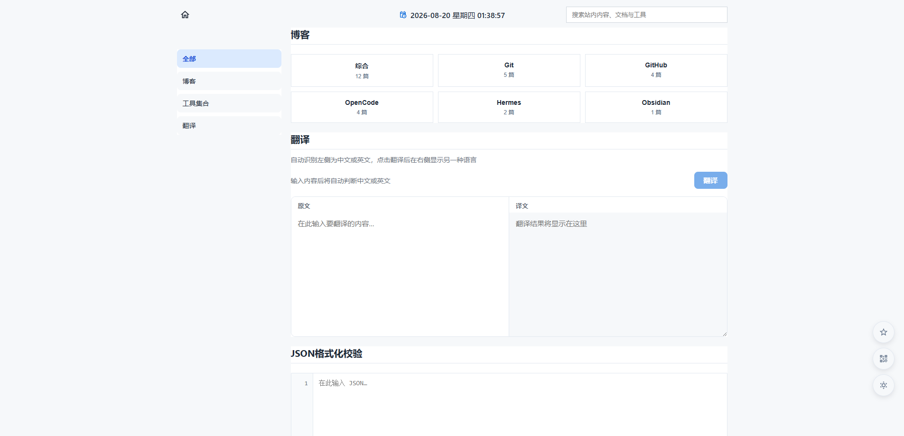
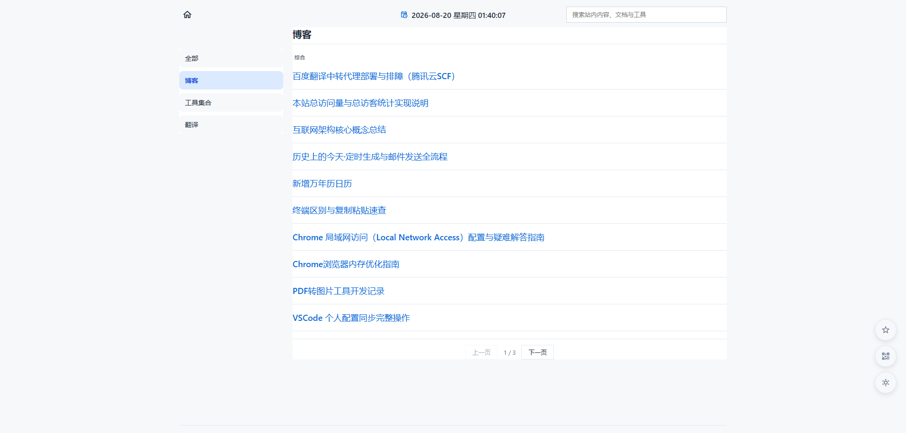

# JsonCC Lab

个人静态站点 **JsonCC Lab**（仓库目录名仍为 `jcclab`，线上路径不变）。基于 **Vue 3 + TypeScript + Vite** 构建，Markdown 内容随仓库维护，部署在 GitHub Pages。

在线地址：<https://jsoncc.github.io/jcclab/>

---

## 功能一览

| 模块 | 说明 |
|------|------|
| 博客 | `src/assets/blog/` 下的 `.md` 文章打包进站点后由前端渲染；列表按文件名前缀自动分组（综合/Git/GitHub/OpenCode/Hermes/Obsidian），组内按名称排序，每页 10 篇 |
| 翻译 | 百度翻译通用 API；开发走 Vite 代理，生产经国内中转代理转发（当前为腾讯云 SCF 函数，可替换为任意可访问的转发地址） |
| 工具集合 | JSON 格式化校验、UUID 批量生成、MyBatis SQL 日志格式化、Base64 编解码、Base64 转文件、PDF 转图片/转 Word |
| 万年历 | 农历、节气、节日查询 |
| 导航 | 左侧「全部 / 单模块」切换；单模块时主区域拉高便于阅读 |
| 全站搜索 | 顶栏输入关键词，实时匹配工具、博客等模块内容 |
| 主题切换 | 浅色 / 深色 2 套主题，全站组件变量化适配 |
| 页脚统计 | 总访问量（PV）/ 总访客（UV），请求 Worker `GET /stats`（需 KV，见 `workers/README.md`） |

> **已隐藏模块**：历史上的今天、今日热榜 — 模块入口已从 UI 移除，脚本和数据保留可恢复。

---

## 快速开始

### 1. 环境要求

- **Node.js** >= 18.0.0（推荐 LTS）

### 2. 安装依赖

```bash
npm install
```

### 3. 环境变量

复制 `.env.example` 为 `.env`，按需填写：

```env
VITE_BAIDU_APP_ID=你的百度翻译_APP_ID
VITE_BAIDU_SECRET=你的百度翻译密钥
# 可选：本地模拟生产时填已部署的转发代理地址（当前生产为腾讯云 SCF 函数 URL，历史方案为 Cloudflare Worker）
# VITE_BAIDU_TRANSLATE_URL=https://xxx.ap-guangzhou.tencentscf.com
```

### 4. 本地开发

```bash
npm run dev        # 仅启动开发服务器
npm run dev:full   # 同时启动开发服务器 + Worker（含页脚统计）
```

### 5. 生产构建与预览

```bash
npm run build    # 先类型检查（vue-tsc），再 vite build，产出 dist/
npm run preview  # 本地预览 dist
```

---

## npm 脚本

| 脚本 | 作用 |
|------|------|
| `npm run dev` | 启动开发服务器（Vite，端口 3000） |
| `npm run dev:full` | 同时启动开发服务器 + Worker（端口 8787，含页脚统计） |
| `npm run build` | `prebuild` -> `vue-tsc --noEmit` -> `vite build`，产出 `dist/` |
| `npm run preview` | 本地预览 `dist/` 打包产物 |
| `npm run typecheck` | 仅运行 TypeScript 类型检查，不打包 |
| `npm run workers:dev` | 本地调试 Cloudflare Worker（端口 8787） |
| `npm run workers:deploy` | 部署 Worker 到 Cloudflare |
| `npm run workers:kv-bind` | 创建/关联 KV 命名空间并写入 `wrangler.toml` |
| `npm run history:generate` | 联网生成指定日期（默认次日）的「历史上的今天」Markdown |
| `npm run history:send-mail` | 通过 SMTP 发送当日历史内容邮件 |
| `npm run history:daily` | 生成 + 发送邮件（一键执行） |

> `prebuild` 会先执行 `check:version`（版本一致性校验），再进入类型检查与构建；Markdown 无需预转换，构建时直接打包。

---

## 界面预览




---

## 安全提示

- 勿将 `.env` 提交进仓库
- `.env.example` 只保留变量名说明，不要写真实密钥
- 密钥若曾泄露，请在百度翻译开放平台重置

---

## 更多文档

- [开发者指南](docs/DEVELOPMENT.md) — 技术栈、仓库结构、部署配置、内容维护等详细说明
- [每日历史邮件配置](docs/history-mail-setup.md) — 定时任务与 SMTP 配置（已暂停）
- [Cloudflare Worker 说明](workers/README.md) — KV 绑定、部署与调试
